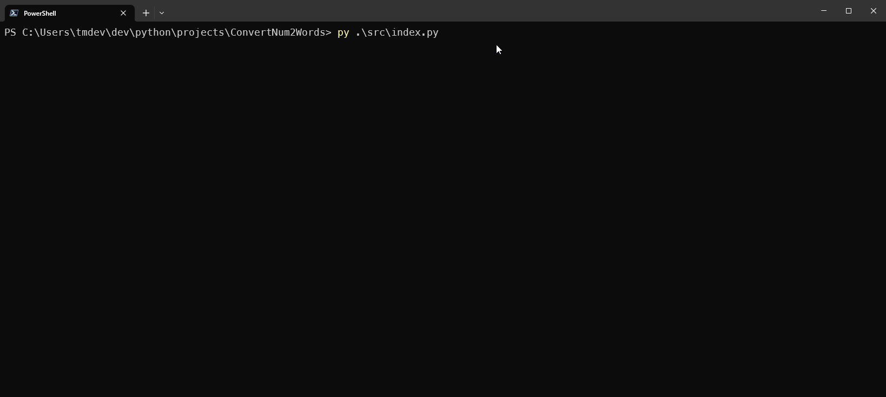

# Proyecto Final

Analisis, Diseño y Arquitectura de Sistemas

## Acerca del proyecto

**Nombre del proyecto:** ConvertNum2Words

**Lenguaje:** Python

**Autores:**

- André Martí Pérez Torres | 405610
- Said Salvador Velázquez Vazquez | 406951
- Jesús Gerado Arredondo Redondo | 406683

**Fecha:** 2023-04-03

## Descripción

Este programa convierte números a su forma escrita. Por ejemplo, el número 123 se convierte en "ciento veintitrés".

## Ejecución

Para ejecutar el programa, se debe ejecutar el archivo `index.py` con Python 3.6 o superior. En seguida le pedirá al usuario que ingrese un número. El programa terminará cuando el usuario ingresa un número negativo.



## Funciones

### `convertir(numero)`

Esta función convierte un número a su forma escrita. Por ejemplo, el número 123 se convierte en "ciento veintitrés".

#### Parámetros

- `numero` - Número a convertir.

#### Retorno

- `str` - Número convertido a su forma escrita.

## Limitaciones

- El programa no soporta números negativos y numeros mayores a un millón.

## Guia de uso

1. Ejecutar el archivo `index.py` con Python 3.6 o superior.

Abre tu terminal y ejecuta el siguiente comando:

```windows
py | python src/index.py
```

2. Ingresa un número.

El programa te pedirá que ingreses un número. El programa terminará cuando el usuario ingrese un número negativo.

